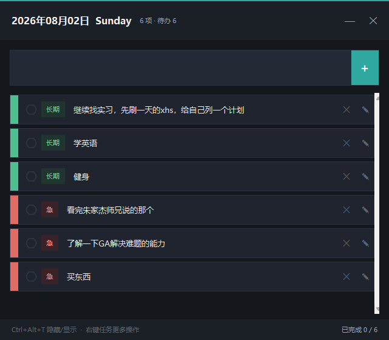
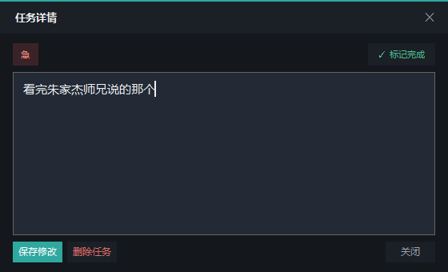

# 📝 ToDoList · 今日 list

> 一款**无广告、无繁琐 UI、只专注记录**的本地桌面待办清单。
> 打开即用，用完即走。

## 💡 项目初衷

市面上的日历 / 待办类 App 越来越多，但体验却越来越重：

- 📢 **广告乱飞** —— 启动开屏广告、横幅广告、会员弹窗层出不穷
- 🧩 **UI 繁琐** —— 权限引导、账号体系、社交分享、商城入口……功能堆砌，核心操作反而被淹没
- 🎯 **本质功能难以使用** —— 只是想「记下今天要做的事，做完打个勾」，却要在一堆无关功能里翻找

**ToDoList 的答案：把一切无关功能砍掉，只保留「记录、完成、延续」三件事。**

- 无广告 · 无账号 · 无弹窗 · 不联网
- 一个窗口装下今天的所有任务
- 打开 3 秒内完成一次「记一笔」操作

## ✨ 功能特性

| 特性 | 说明 |
|---|---|
| 🎨 极简深色界面 | 暖近黑底 + 单强调色，无任何视觉噪音 |
| ⌨️ 全局快捷键 | `Ctrl+Alt+T` 随时呼出 / 隐藏窗口 |
| 🏷️ 分类管理 | 「急 / 长期 / 不急」胶囊标签 + 分类色条，一目了然 |
| 📄 任务详情二级窗口 | 双击任务行，查看全文 + 编辑 + 完成 + 删除 |
| 🔄 自动顺延 | 未完成任务次日自动带入（无冗余标志打扰） |
| 💾 本地数据 | JSON 文件存储，数据完全自持，不上传任何云端 |
| 🪟 无边框 + 系统圆角 | 原生 DWM 圆角（Windows 11），自绘标题栏 + 最小化 / 关闭按钮 |
| 📊 今日统计 | 标题栏实时显示「N 项 · 待办 M」与完成计数 |

## 📸 界面预览

| 主界面 | 任务详情（二级窗口） |
|---|---|
|  |  |

## 🚀 快速开始

### 环境要求
- Windows 10 / 11
- Python 3.8+

### 安装与启动
```bash
# 1. 安装依赖（仅一个：全局热键支持）
pip install -r requirements.txt

# 2. 启动
python task_widget.py
# 或直接双击 start.bat
```

## 📖 使用说明

| 操作 | 方式 |
|---|---|
| 添加任务 | 顶部输入框输入内容，按 `Enter` 或点击 ➕ |
| 标记完成 | 点击任务左侧 ○ 圆圈 |
| 查看 / 编辑全文 | **双击任务行**（长文本不再被截断） |
| 分类 / 更多操作 | 任务行**右键菜单**（完成 / 恢复 / 编辑 / 分类 / 删除） |
| 隐藏 / 显示 | `Ctrl+Alt+T` 全局快捷键 |
| 最小化 | 标题栏 `—`（等同隐藏，快捷键可恢复） |
| 退出 | 标题栏 `✕` |

## 🗂️ 数据存储

- 任务数据保存在程序同目录：`task_widget.json`
- 纯本地 JSON，无任何云端同步；删除该文件即可清空所有数据

## 🛠️ 技术栈

- **Python 3** + **Tkinter**（标准库 GUI，零额外界面依赖）
- **keyboard** —— 全局快捷键监听
- **Win32 API**（ctypes）—— 无边框窗口、DWM 系统圆角、单实例端口守护

## 📦 项目结构

```
task_widget/
├── task_widget.py      # 主程序（单文件实现）
├── requirements.txt    # 依赖清单
├── start.bat           # Windows 一键启动
├── docs/               # README 截图
└── task_widget.json    # 本地数据（自动生成，不入库）
```

## 📄 License

个人开源项目，欢迎学习与二次开发。
